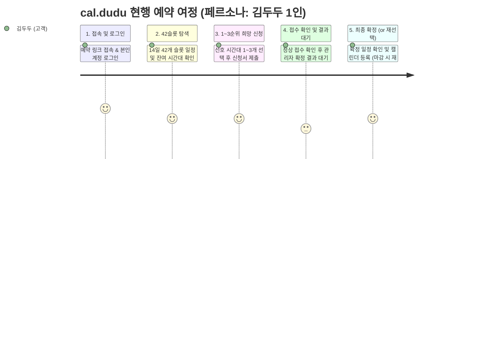
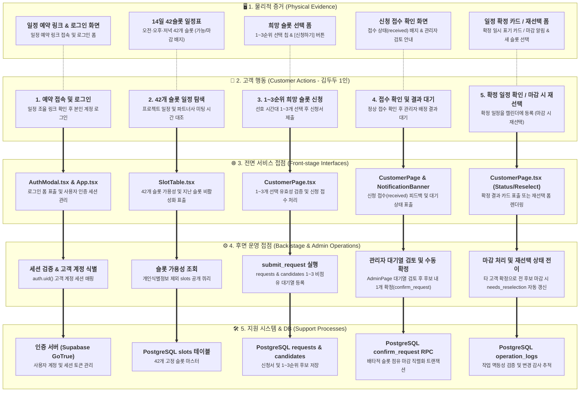

# Service Blueprint (As-Is): cal.dudu (Visual Mermaid Diagram)

> **대상 사용자**: 김두두 (31세 · IT 서비스 기획자, INTP)  
> **범위**: `cal.dudu` 온라인 일정 예약 서비스의 5단계 여정, 관리자 수동 확정(백스테이지) 및 데이터베이스 트랜잭션  
> **원칙**: 사용자 행동(Customer Actions)은 김두두 1인의 실제 여정으로 고정하며, 관리자 확정 작업은 후면 운영 접점(Back-stage)으로 분리하고 제작자·개발자 관점을 배제함

---

## 📊 1. Service Blueprint 사용자 여정 (Mermaid Journey)

---

## 🧩 2. 계층별 상호작용 아키텍처 (Mermaid Flowchart)

---

## 🔍 핵심 특징 및 병목 구간 분석

1. **단일 고객 여정과 운영 백스테이지의 명확한 분리**
   - **설계 원칙**: 고객 행동 레인은 오직 서비스 이용자인 **김두두(기획자)** 1인의 시선에서 수행하는 실제 행동만 기록합니다.
   - **운영 분리**: 관리자(어드민)의 대기열 검토 및 수동 확정 클릭은 전면 행동이 아닌 **후면 운영 접점(Back-stage)**에 배치되어 배타적 점유 마감 트랜잭션을 트리거합니다.
2. **비점유 접수와 관리자 수동 확정 간의 대기 시간 (Bottleneck)**
   - **현상**: 고객이 원하는 1~3순위 슬롯을 제출해도 슬롯이 점유되지 않는 대기(received) 상태로 유지되며, 관리자가 수동 확정하기 전까지 결과를 기다려야 합니다.
   - **시사점**: 여러 사용자가 동일 시간대를 신청할 경우, 관리자가 다른 고객을 먼저 확정하면 김두두는 전 후보 소진으로 '재선택 필요(needs_reselection)' 상태가 될 수 있습니다. (To-Be에서 3순위 넛지 및 원클릭 스마트 프리셋으로 해결)

