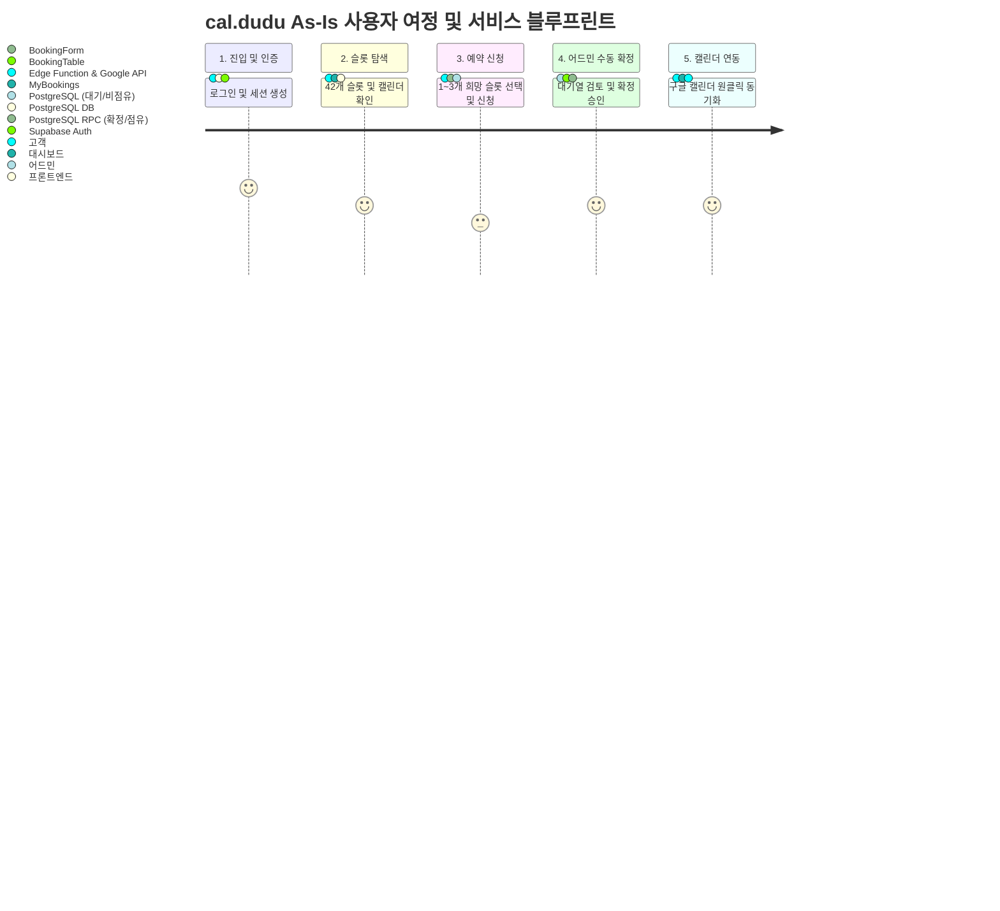

# Service Blueprint (As-Is): cal.dudu (Visual Mermaid Diagram)

> **대상 사용자**: 김두두 (INTP, IT업계 기획자, 즉흥적 대처 성향)  
> **범위**: `cal.dudu` 서비스의 현재(As-Is) 예약 신청, 어드민 수동 확정, 구글 캘린더 연동 프로세스  
> **시각화**: Mermaid.js 기반 서비스 블루프린트 흐름도

---

## 📊 Service Blueprint 다이어그램

아래 다이어그램은 **물리적 증거(Evidence), 고객 행동(Customer Actions), 프론트엔드 접점(Front-stage), 백스테이지(Back-stage), 지원 프로세스(Support)** 간의 상호작용을 시각화한 것입니다.



---

## 🧩 레이어별 상호작용 아키텍처 (Mermaid Flowchart)

```mermaid
graph TB
    subgraph Evidence [🖥️ 물리적 증거 / UI]
        E1[로그인 페이지] --> E2[대시보드 / 캘린더 뷰]
        E2 --> E3[예약 폼 & 카카오 주소 검색]
        E3 --> E4[마이bookings & 구글 캘린더 이벤트]
    end

    subgraph Customer [👤 고객 행동]
        C1[1. 로그인 수행] --> C2[2. 42슬롯 탐색]
        C2 --> C3[3. 1~3개 희망 슬롯 신청]
        C3 --> C4[4. 어드민 승인 대기]
        C4 --> C5[5. 구글 캘린더 동기화]
    end

    subgraph FrontStage [🌐 프론트엔드 접점]
        F1[src/lib/supabase.ts] --> F2[slots.ts / CalendarView.tsx]
        F2 --> F3[BookingForm.tsx & decide.ts]
        F3 --> F4[MyBookings.tsx]
    end

    subgraph BackStage [⚙️ 백스테이지 접점]
        B1[Supabase Auth 세션 검증] --> B2[slots 테이블 조회]
        B2 --> B3[bookings 테이블 (대기/비점유 저장)]
        B3 --> B4[어드민 수동 확정 RPC (점유 처리)]
    end

    subgraph Support [🛠️ 지원 프로세스 & 시스템]
        S1[Supabase 인증 서버] --> S2[PostgreSQL DB (RLS 보안)]
        S2 --> S3[add-to-calendar Edge Function]
        S3 --> S4[Google OAuth2 토큰 갱신 & Google Calendar API v3]
    end

    %% 연결 관계 매핑
    C1 --- F1 --- B1 --- S1
    C2 --- F2 --- B2 --- S2
    C3 --- F3 --- B3 --- S2
    C4 --- F3 --- B4 --- S2
    C5 --- F4 --- B4 --- S3
    S3 --> S4
```

---

## 🔍 핵심 병목 구간 (Bottlenecks) 분석

1. **대기(Pending) 상태와 즉흥적 성향의 괴리**
   - **현상**: 고객(INTP 기획자)이 예약을 신청해도 '대기(비점유)' 상태로 들어가며 어드민의 수동 확정을 기다려야 합니다.
   - **시사점**: 즉흥적이고 빠른 처리를 선호하는 유저에게 대기 시간은 이탈 요인이 될 수 있습니다.
2. **외부 API(Google Calendar) 연동 의존성**
   - **현상**: `add-to-calendar` Edge Function에서 토큰 만료, CORS, 시간 포맷 오류 발생 시 동기화가 실패합니다.
   - **시사점**: 실패 시 명확한 에러 피드백과 재시도(Operation ID) 메커니즘이 중요합니다.
